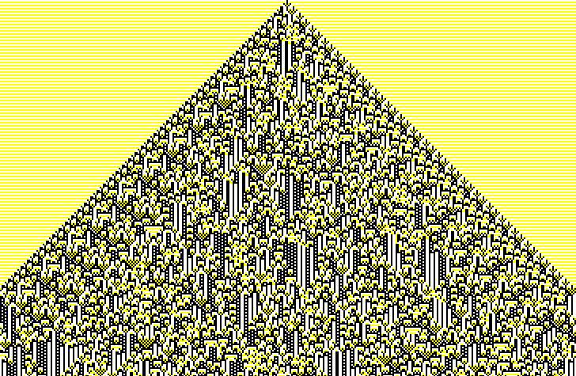
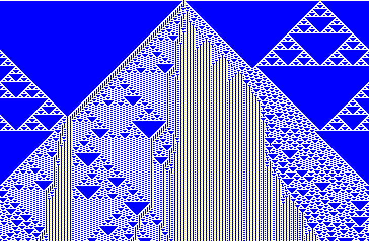

# Automaton

Draw 1-D cellular automatons [in your browser](http://automaton.florianb.webfactional.com/ 'Automaton').

[2 5 3283936144](http://automaton.florianb.webfactional.com/#colors=2&neighborhood=5&ruleID=3283936144&density=9999&size=1)

[3 3 508373165630](http://automaton.florianb.webfactional.com/#colors=3&neighborhood=3&ruleID=508373165630&density=1&size=2)

[4 3 255377928690176962081643936791146418995](http://automaton.florianb.webfactional.com/#colors=4&neighborhood=3&ruleID=255377928690176962081643936791146418995&density=1&size=2)

# Keyboard

Browse automatons with up and down arrows when rule field is active. 
Shift + arrow skips ten.

# Disclaimer

More neighbors + colors = browser death
